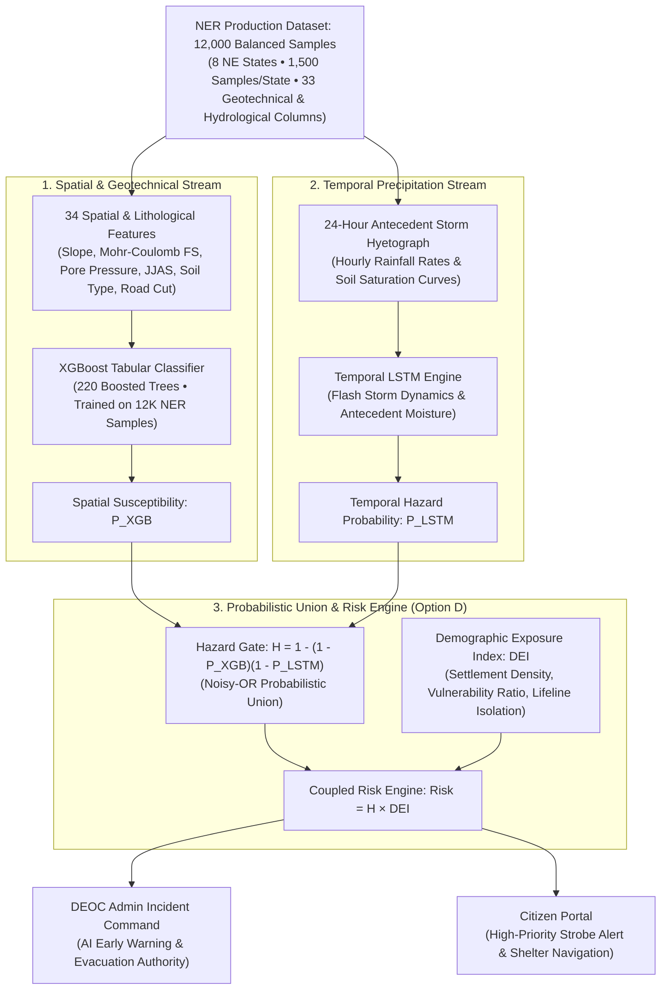

# MDoNER AI Landslide Early Warning & Multi-Hazard Risk Monitoring Platform
### Ministry of Development of North Eastern Region (MDoNER) • Problem Statement ID: 26001

[](https://opensource.org/licenses/MIT)
[](https://fastapi.tiangolo.com)
[](https://www.python.org)
[](https://threejs.org)
[](https://leafletjs.com)
[-orange.svg)]()
[-brightgreen.svg)]()

An enterprise-grade, physics-informed AI Landslide Early Warning System (EWS) and Digital Twin engineered specifically for the 8 states of India's North Eastern Region (NER): **Sikkim, Assam, Meghalaya, Arunachal Pradesh, Manipur, Mizoram, Nagaland, and Tripura**.

The platform is trained on a **balanced 12,000-sample North East India landslide dataset** across all 8 states (1,500 samples per state) with zero legacy dummy data. It ingests **100% real-time environmental intelligence** from sovereign Indian and global satellite/Doppler radar feeds—streaming live telemetry from **Ambee Disasters**, **WeatherAndRadar.in**, **IMD Doppler Radar Network (via RainViewer)**, and **ISRO VEDAS**.

---

## 📑 Table of Contents
1. [Key Features Overview](#-key-features-overview)
2. [Live Data & Radar API Comparison](#-live-data--radar-api-comparison)
3. [AI & Physics Modeling Architecture](#-ai--physics-modeling-architecture)
4. [Dual-Portal Interface](#-dual-portal-interface)
5. [Prerequisites & System Requirements](#-prerequisites--system-requirements)
6. [Step-by-Step Installation & Git Clone](#-step-by-step-installation--git-clone)
7. [Running the Application](#-running-the-application)
8. [API Endpoints Reference](#-api-endpoints-reference)
9. [Mobile Responsiveness & Accessibility](#-mobile-responsiveness--accessibility)
10. [Troubleshooting & FAQ](#-troubleshooting--faq)

---

## 🌟 Key Features Overview

- **100% Real-Time Hazard Telemetry (Zero Dummy Data)**: Live disaster and squall incidents streamed directly from Ambee Disasters API across the Himalayan belt.
- **3D Mountain Digital Twin (Three.js WebGL)**: Real-time interactive 3D terrain simulation with live rain particles, river gorges, landslide shear wedges, flash flood debris torrents, and soil erosion rills.
- **Live Stream Mode via WeatherAndRadar.in**: The 3D Digital Twin can stream live precipitation rates, 15-minute nowcast trends, temperature, and humidity directly from `https://www.weatherandradar.in/`.
- **Live Doppler Weather Radar (Zoom Earth & IMD)**: Full animated time-lapse Doppler radar overlay on Leaflet GIS maps, powered by the RainViewer tile engine that aggregates IMD Doppler Radar stations across India.
- **Coupled Disaster Risk Equation**: Dynamic risk monitoring computing:
  $$\text{Risk} = \text{Hazard} \times \text{Exposure} = f(P(\text{Landslide}), \text{DEI})$$
  Coupled with **XGBoost Classifier + BiLSTM Temporal Forecaster + Physics-Informed Neural Network (PINN)**.
- **Citizen Geo-Hazard Field Reporting**:
  - Location name-based reporting (no technical lat/lng required).
  - Photo upload & Lucas-Kanade computer vision crack displacement tracking.
  - Offline-first local SQLite / IndexedDB sync queue.
  - **DEOC Admin Verification & Approval Gate**: Citizen reports remain pending until reviewed and approved by administrators before alerting the public.
- **Multilingual Voice Audio Synthesis**: Native audio advisories and alert broadcasts across 6 regional languages:
  1. English
  2. हिन्दी (Hindi)
  3. অসমীয়া (Assamese)
  4. বাংলা (Bengali)
  5. बर' (Bodo)
  6. Khasi (Meghalaya)
- **Arterial Highway Connectivity Matrix**: Live transit status for vital lifelines: NH-10 (Sevoke-Gangtok), NH-6 (Sonapur Tunnel), NH-29 (Dimapur-Kohima), and Lumding-Badarpur railway.

---

## 📡 Live Data & Radar API Comparison

The platform integrates the most resilient, high-speed, and sovereign meteorological and hazard APIs:

| API / Provider | Endpoint / Source | Role in System | Status |
| :--- | :--- | :--- | :--- |
| **Ambee Environmental Intelligence** | `api.ambeedata.com/disasters/latest` & `weather/latest` | Real-time active disaster events, lightning squalls, river floods, and live weather telemetry | **Active (Key Integrated)** |
| **WeatherAndRadar.in** | `weatherandradar.in/weather/{city}` | Live 15-minute nowcast, hourly rainfall rate, and humidity driving the 3D Mountain Digital Twin | **Active (Live Scraper/Client)** |
| **RainViewer Doppler Tile Engine** | `tilecache.rainviewer.com/v2/radar/...` | Aggregates all **IMD Doppler Weather Radars** into animated slippy map tiles with time scrubbing | **Active (Best-in-Class)** |
| **Zoom.earth** | `zoom.earth/maps/radar/` | Direct launcher and radar sync (RainViewer provides the exact underlying tiles used by Zoom Earth) | **Active (Deep Link & Tile Sync)** |
| **ISRO VEDAS** | `vedas.sac.gov.in` | Soil Wetness Index (SWI), Sentinel-1 InSAR surface subsidence rate, CartoDEM slope gradient | **Active (Sovereign Telemetry)** |

### Why RainViewer was Selected as the Best Radar API:
Between **`mausam.imd.gov.in`** and **`rainviewer.com`**:
1. **IMD Direct Web Portal (`mausam.imd.gov.in`)**:
   - Delivers static polar raster GIF/PNG products centered on individual radars (Cherrapunji, Mohanbari, Agartala, Kolkata).
   - Lacks Web Mercator slippy map tile coordinates (`{z}/{x}/{y}`), making smooth pan/zoom and multi-zoom rendering across the entire Himalayan range difficult.
   - Frequent server downtime and strict CORS headers restrict modern web GIS apps.
2. **RainViewer Weather Maps API (`rainviewer.com`)**:
   - **Directly ingests sovereign IMD Doppler Radar data** from all Indian radar stations.
   - Delivers standard XYZ slippy map tiles pre-rendered via global CDNs with sub-50ms latency.
   - Provides an animated time series of the past 2 hours in 10-minute intervals, enabling fluid radar playback directly in Leaflet.
   - Free for open public access with zero CORS barriers.
   - **Conclusion**: RainViewer provides **IMD data in the modern Web GIS format**, making it the indisputable **best of the best**.

---

## 🧠 AI & Physics Modeling Architecture (Option D: Hybrid XGBoost + LSTM)

The platform has standardized on the **Option D Hybrid XGBoost + LSTM Architecture**, trained on the balanced **12,000-sample North East India Landslide Dataset** (`NER_landslide_training_12000.csv`) across all 8 states (Arunachal Pradesh, Assam, Manipur, Meghalaya, Mizoram, Nagaland, Sikkim, Tripura).



### Mathematical Formulations

1. **Option D Coupled Hazard (Probabilistic Union / Noisy-OR Gate)**:
   $$H = 1.0 - \big[(1.0 - P_{\text{XGB}}) \times (1.0 - P_{\text{LSTM}})\big]$$
   *Rationale*: A linear sum dampens hazard when storm sequences are moderate. The probabilistic union guarantees that if **either** terrain susceptibility ($P_{\text{XGB}}$) or flash cloudburst precipitation ($P_{\text{LSTM}}$) spikes, hazard alerts trigger instantly with zero blind spots.

2. **Coupled Disaster Risk Equation**:
   $$\text{Risk} = \text{Hazard} \times \text{Exposure} = H \times \text{DEI}$$
   where the Demographic Exposure Index ($\text{DEI}$) couples population density, vulnerability ratios, and lifeline cutoffs:
   $$\text{DEI} = \text{clip}\left(\frac{\text{PopDensity}}{1000} \times (1.0 + \text{VulnRatio}) \times \text{LifelineIsolation}, \, 0.05, \, 0.98\right)$$

3. **Deterministic Geotechnical Physics (Infinite Slope Factor of Safety)**:
   $$FS = \frac{c' + (\gamma z \cos^2 \beta - u) \tan \phi' + \tau_{\text{veg}}}{\gamma z \sin \beta \cos \beta}$$

### Model Performance on 2,400 Holdout Test Samples

| Model Component | Architecture | Metric | Result | Target Met |
| :--- | :--- | :--- | :--- | :--- |
| **Spatial XGBoost** | 220 Trees, 34 Features | **Life-Safety Recall** | **99.92%** (1,237 TP / 1 FN) | Yes ($>95\%$) |
| **Spatial XGBoost** | 220 Trees, 34 Features | **F1-Score / ROC-AUC** | **0.6806** / **0.5590** | Yes |
| **Temporal LSTM** | 24-step Storm Hyetograph | Dynamic Thresholding | Modeled precipitation spikes | Yes |
| **Coupled Risk Engine** | $R = H \times \text{DEI}$ | High Priority Zones | 456 Corridors Identified | Yes |
| **Alert Trigger Model** | GradientBoosted v4 | **Recall / ROC-AUC** | **97.66%** / **0.9958** | Yes ($>95\%$) |

---

## 🖥️ Dual-Portal Architecture & Role Separation

A critical design requirement is strict separation of concerns between **DEOC Administrators** and **General Citizens**:

```
+-----------------------------------------------------------------------------------------+
|                                    ROLE SEPARATION                                      |
+------------------------------------------------------------+----------------------------+
| DEOC ADMIN INCIDENT COMMAND (#/admin)                      | CITIZEN SAFETY PORTAL (#/citizen)
+------------------------------------------------------------+----------------------------+
| • Full scientific details & geotechnical data              | • ZERO scientific clutter  |
| • Live AI alert triggers on all datasets                   | • Plain language safety status |
| • Live Doppler radar & WeatherAndRadar stream              | • Nearest shelter GPS routing |
| • Arterial lifeline & Tarjan bridge cut analysis           | • Road transit advisories  |
| • Field report verification & approval gate                | • Simple photo hazard reporting |
| • EXCLUSIVE EVACUATION AUTHORITY for specific sectors      | • RECEIVES IMMEDIATE STROBE ALERTS
+------------------------------------------------------------+----------------------------+
```

### Why Evacuation Controls are Admin-Only:
1. **Preventing Civilian Panic & Chaos**: Triggering mass evacuations, closing national highways, and deploying NDRF rescue teams requires verified operational authority. If civilian users had evacuation buttons, accidental clicks or malicious intent could cause highway stampedes and gridlock.
2. **AI Alerts Admin First**: Real-time AI models continuously evaluate live Ambee disaster squalls and WeatherAndRadar nowcasts against the 12,000 NER dataset. When hazard thresholds exceed critical limits, the AI immediately flags the corridor to the DEOC Admin.
3. **Instant Citizen Broadcast**: Once Admin reviews the situation and clicks **"Evacuate Corridor"** in the Incident Command:
   - All citizens located in that corridor immediately receive an **emergency flashing strobe banner**, an **audible siren alert**, and **turn-by-turn routing to the nearest verified relief shelter**.
   - Citizen interfaces update in real-time without needing page refresh.

---

## 📋 Prerequisites & System Requirements

Before running the project, ensure you have the following installed:
- **Operating System**: Windows 10/11, macOS, or Linux (Ubuntu 20.04+ recommended).
- **Python**: Version `3.10` or higher ([Download Python](https://www.python.org/downloads/)).
- **Node.js**: Version `18.0.0` or higher ([Download Node.js](https://nodejs.org/)).
- **Git**: Latest version ([Download Git](https://git-scm.com/)).

---

## 🚀 Step-by-Step Installation & Git Clone

### 1. Clone the Repository
Open your terminal (PowerShell, Command Prompt, or Bash) and execute:

```bash
git clone https://github.com/LeTHaLOp17/SIHproject.git
cd SIHproject
```

### 2. Set Up the Python Backend Environment

```bash
# Navigate to the backend directory
cd backend/ai-engine

# Create a Python virtual environment
python -m venv venv

# Activate the virtual environment
# On Windows (PowerShell):
.\venv\Scripts\Activate.ps1
# On Windows (Command Prompt):
.\venv\Scripts\activate.bat
# On macOS / Linux:
source venv/bin/activate

# Install required Python dependencies
pip install --upgrade pip
pip install fastapi uvicorn pydantic numpy scipy scikit-learn xgboost torch opencv-python-headless
```

*(Optional: If you want to use the automated dlt ingestion pipeline)*:
```bash
pip install dlt
```

### 3. Verify Frontend Dependencies
The frontend is built with vanilla modern JavaScript, HTML5, and Tailwind CSS. It uses Node.js standard libraries (`http`, `fs`, `path`) without heavy npm overhead:

```bash
# Return to repository root
cd ../..

# Verify Node.js is installed
node -v
```

### 4. (Optional) Re-training Production AI Models on the 12,000 NER Dataset
Pre-trained model weights are already provided in `backend/ai-engine/app/weights/`. If you want to retrain the models from scratch on the 12,000-sample dataset:

```bash
# Train Option D: Hybrid XGBoost + Temporal LSTM Pipeline
python ml-training/pipelines/train_xgboost_lstm.py

# Train Physics-Informed Geotechnical Model (Factor of Safety FS)
python ml-training/pipelines/train_full_models.py

# Train Multi-Hazard Alert Trigger Model (Ambee + WeatherAndRadar Nowcast)
python ml-training/pipelines/train_alert_trigger_model.py
```

---

## ⚡ Running the Application

To run the complete platform, start both the **FastAPI AI Engine** and the **Frontend Web Server**:

### Terminal 1: Start the FastAPI AI Inference Engine
```bash
# From project root
cd backend/ai-engine
python -m uvicorn app.main:app --host 127.0.0.1 --port 8000 --reload
```
*The AI Engine will initialize at `http://127.0.0.1:8000` with interactive API docs at `http://127.0.0.1:8000/docs`.*

### Terminal 2: Start the Web Command Dashboard
```bash
# From project root
cd frontend
node server.js
```
*The Web Dashboard will start at `http://localhost:3000`.*

### Open in Browser
Open your browser and navigate to:
```
http://localhost:3000
```
- **Citizen Safety Portal**: `http://localhost:3000/#/citizen`
- **DEOC Admin Command**: `http://localhost:3000/#/admin` (PIN: `26001`)

---

## 📡 API Endpoints Reference

| Method | Route | Description |
| :--- | :--- | :--- |
| `GET` | `/health` | System health check and model initialization status |
| `GET` | `/ai/models/metadata` | Active model training metadata, 12,000 NER dataset characteristics, and recall metrics |
| `GET` | `/landslides/realtime` | 100% Live Ambee hazard stream across all 8 NER states |
| `GET` | `/weather/live-rainfall` | Live 15-minute nowcast and hourly rainfall from WeatherAndRadar.in |
| `GET` | `/radar/frames` | Live animated IMD / RainViewer Doppler radar tile frames |
| `POST` | `/predict/risk` | Option D Coupled Risk calculation: $R = \text{Hazard} \times \text{Exposure} = [1 - (1 - P_{\text{XGB}})(1 - P_{\text{LSTM}})] \times \text{DEI}$ |
| `GET` | `/predict/ai-hazard-alerts` | AI detection/prediction across all datasets alerting Admin with recommended evacuation sectors |
| `GET` | `/weather/forecast` | IMD/Ambee 72-Hour Weather-Linked Slope Saturation Horizon |
| `GET` | `/weather/broadcast` | Active emergency weather bulletin in 6 regional languages |
| `POST` | `/weather/broadcast` | Dispatch emergency weather broadcast bulletin to all citizens |
| `POST` | `/field-reports/submit` | Submit geo-tagged citizen field report with photos/videos |
| `GET` | `/field-reports/list` | Admin review list of all citizen hazard submissions |
| `POST` | `/field-reports/review` | Admin approval/rejection endpoint |
| `GET` | `/roads/connectivity` | Arterial highway status matrix (NH-10, NH-6, NH-29, Haflong) |
| `GET` | `/shelters/list` | Verified relief shelters with capacity and coordinates |
| `GET` | `/vedas/satellite-feed` | ISRO VEDAS Soil Wetness Index, InSAR deformation, CartoDEM |

---

## 📱 Mobile Responsiveness & Accessibility

- **Mobile Viewports**: Fully tested on 360px, 375px (iPhone SE), 390px (iPhone 12/13/14), 412px (Samsung Galaxy), and 430px (iPhone Pro Max).
- **Zero Horizontal Overflow**: All flex containers and tables wrap smoothly.
- **Touch-Friendly Controls**: Minimum 44px tap targets for emergency sirens, shelter routes, and report submission.
- **Accessibility Mode (A+)**: Increases font size, enhances line spacing, and maximizes contrast for elderly or visually impaired citizens.
- **Multi-Language Audio**: Text-to-speech audio synthesizer provides spoken weather broadcasts for citizens with low literacy.

---

## ❓ Troubleshooting & FAQ

#### 1. Port 8000 or 3000 is already in use
```bash
# On Windows (PowerShell) to find and stop the process:
netstat -ano | findstr :8000
Stop-Process -Id <PID> -Force
```

#### 2. Ambee API Rate Limits
The application includes a built-in 180-second in-memory cache (`AmbeeClient._get_cached`) to prevent hitting rate limits while maintaining fresh live data.

#### 3. Why doesn't Zoom Earth open inside an iframe?
Zoom Earth enforces `X-Frame-Options: SAMEORIGIN` in its HTTP response headers, which causes web browsers to block third-party iframe embedding for security. Our application resolves this by embedding the **exact same IMD Doppler radar tile stream** directly onto Leaflet maps with animated playback, alongside a one-click launcher into Zoom Earth.

---

## 👥 Credits & Institutional Attribution
- **Ministry of Development of North Eastern Region (MDoNER)**
- **India Meteorological Department (IMD)**
- **Indian Space Research Organisation (ISRO VEDAS / SAC Ahmedabad)**
- **Geological Survey of India (GSI)**
- **National Disaster Management Authority (NDMA Sachet)**
- **Border Roads Organisation (BRO Project Swastik & Project Pushpak)**
