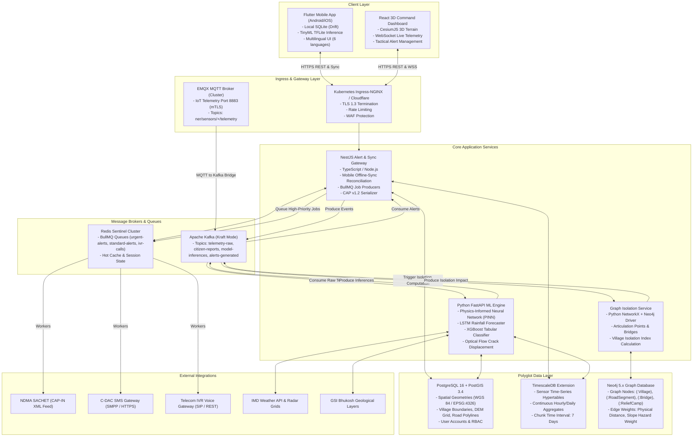

# Technical Requirements Document (TRD)
## AI-Based Landslide Early Warning & Risk Monitoring Platform
**Target Stack**: Python FastAPI | NestJS (TypeScript) | React + CesiumJS | Flutter (Dart) | PostgreSQL + PostGIS | TimescaleDB | Neo4j | Kafka | EMQX | Redis  
**Document Version**: 2.4.0 (Production Architecture)

---

## 1. System Architecture Overview

The system utilizes a polyglot microservice architecture designed for high availability, sub-second geographical indexing, real-time sensor processing, and high-concurrency emergency alerting.

---

## 2. Microservice Specifications

### 2.1 Python FastAPI AI/ML Serving Service (`backend/ai-engine`)
- **Runtime**: Python 3.11-slim, Uvicorn (worker class `uvloop`), Gunicorn process manager.
- **Role**: Execute real-time hybrid ensemble model inference and CV image processing.
- **Resource Limits**: 4 CPU Cores, 8 GB RAM per pod, Horizontal Pod Autoscaler (HPA) targeting 70% CPU.
- **Key Modules**:
  - `PINNInference`: Evaluates infinite slope Factor of Safety (\(FS\)) with continuous loss minimization.
  - `LSTMRainfall`: Sequences 24-step hourly precipitation to forecast future 6-12 hour soil water saturation.
  - `XGBoostClassifier`: Processes 17 tabular geomorphological and conditioning features.
  - `CrackOpticalFlow`: Farneback / Lucas-Kanade dense optical flow computation between time-stamped images.

### 2.2 NestJS Alert & Data Gateway (`backend/alert-dispatcher`)
- **Runtime**: Node.js v20 LTS, TypeScript 5.x, Fastify adapter for maximum throughput.
- **Role**: Client authentication, mobile offline-sync ingestion, BullMQ job scheduling, multi-channel dispatch.
- **Key Modules**:
  - `CapService`: Formats alert payloads to OASIS CAP-IN v1.2 specification with XML digital signature.
  - `QueueModule`: BullMQ workers with concurrency 50, exponential backoff (initial 2000ms, 5 retries).
  - `SyncController`: Conflict resolution using Last-Write-Wins (LWW) and device-side UUID keys.
  - `ChannelDispatchers`:
    - SMS via CDAC HTTPS/SMPP interface.
    - Automated IVR telephony trigger via SIP/REST webhook.
    - WebPush / Firebase Cloud Messaging (FCM) push tokens.

### 2.3 Graph Theory Isolation Engine (`backend/graph-isolation`)
- **Runtime**: Python 3.11 with NetworkX 3.x and official Neo4j Python Bolt driver.
- **Role**: Model road connectivity, detect single points of failure (bridges, cut vertices), and prioritize evacuation.
- **Algorithm**:
  - Builds bipartite network \(G = (V, E)\) of Villages \(V_{vill}\), Road Intersections \(V_{int}\), and Road Segments \(E\).
  - Evaluates bridge edges using Tarjan's \(O(V + E)\) depth-first bridge-finding algorithm.
  - Dynamically recalculates the shortest path \(d(v, \text{HQ})\) using Dijkstra with hazard-penalized edge weights.
  - Computes Village Isolation Index \(I_{iso}\):
    \[
    I_{iso}(v) = \text{Population}(v) \times \left(1 + \frac{\text{VulnerablePop}(v)}{\text{TotalPop}(v)}\right) \times \frac{1}{\max(1, \text{AlternateRoutes}(v))}
    \]

---

## 3. Data Storage & Polyglot Persistence Architecture

### 3.1 PostgreSQL 16 with PostGIS 3.4 (Spatial Database)
- **Primary SRID**: EPSG:4326 (WGS 84) for ingestion; EPSG:32646 (UTM Zone 46N) for metric distance calculations.
- **Storage Strategy**: Spatial indexing via `GIST (geom)` on all polygons, roads, and landslide centroids.

### 3.2 TimescaleDB 2.14 (Sensor Time-Series Engine)
- **Hypertable**: `sensor_telemetry` partitioned on `timestamp` with 7-day chunk intervals.
- **Compression Policy**: Compressed after 14 days by segmenting on `node_id`.
- **Continuous Aggregates**:
  - `sensor_hourly_summary`: Materialized view recalculating average rainfall rate, maximum inclination, and pore water pressure every 15 minutes.

### 3.3 Neo4j 5.x (Road Network & Village Graph Database)
- **Node Labels**: `Village`, `RoadIntersection`, `RoadSegment`, `Bridge`, `Hospital`, `Helipad`.
- **Relationships**:
  - `(:Village)-[:CONNECTS_TO]->(:RoadIntersection)`
  - `(:RoadIntersection)-[:ROAD_LINK {length_km, slope_risk_score, is_blocked}]->(:RoadIntersection)`
  - `(:RoadSegment)-[:HAS_STRUCTURE]->(:Bridge)`

### 3.4 Local Mobile Database (SQLite via Drift / sqflite)
- Embedded in Flutter mobile app.
- Stores offline spatial bounding boxes (R-Tree), recent alert notices, local crack survey logs, and telemetry cache.

---

## 4. Message Queuing & Event Bus Specifications

| Broker | Entity / Topic | Partition Key | Payload Description |
| :--- | :--- | :--- | :--- |
| **EMQX** | `ner/sensors/{nodeId}/telemetry` | N/A | MQTT JSON payload with sensor readings, battery voltage, signal RSSI. |
| **Kafka** | `telemetry-raw` | `node_id` | Decoded sensor time-series data sent to TimescaleDB & AI inference. |
| **Kafka** | `citizen-reports` | `district_id` | Citizen uploaded slope observations, crack images, GPS metadata. |
| **Kafka** | `hazard-predictions` | `grid_id` | Real-time \(FS\) and probability scores generated by AI engine. |
| **Redis** | `bull:urgent-alerts:jobs` | Priority Level | Critical and Evacuation mandate notifications requiring immediate SMS/IVR. |
| **Redis** | `bull:standard-alerts:jobs`| Priority Level | Advisory and Watch level notifications sent via Push/WebPush. |

---

## 5. Security, Authentication & Role-Based Access Control (RBAC)

1. **Authentication**:
   - OAuth 2.0 + OpenID Connect (OIDC) with JSON Web Tokens (JWT) signed using RS256.
   - Citizen reporting requires zero login (rate-limited via IP + Device Fingerprint) to enable frictionless emergency reporting.
2. **Role Hierarchy**:
   - `SUPER_ADMIN`: National Disaster Management Authority (NDMA) / Ministry of MDoNER.
   - `SDMA_OFFICER`: State Disaster Management Authority (e.g., Sikkim SDMA, Assam SDMA) - can authorize evacuations.
   - `DDMA_OFFICER`: District Disaster Management Authority - manages local alert broadcasts.
   - `FIELD_ENGINEER`: GSI / BRO / NHIDCL - updates geotechnical instrumentation and validates slope stability.
   - `CITIZEN`: Public users with read-only alerts, localized safety routes, and crowd-sourced reporting capabilities.
3. **mTLS for Field IoT**:
   - EMQX MQTT Broker mandates Mutual TLS (mTLS) with X.509 client certificates embedded into IoT gateway hardware security modules (HSM).
