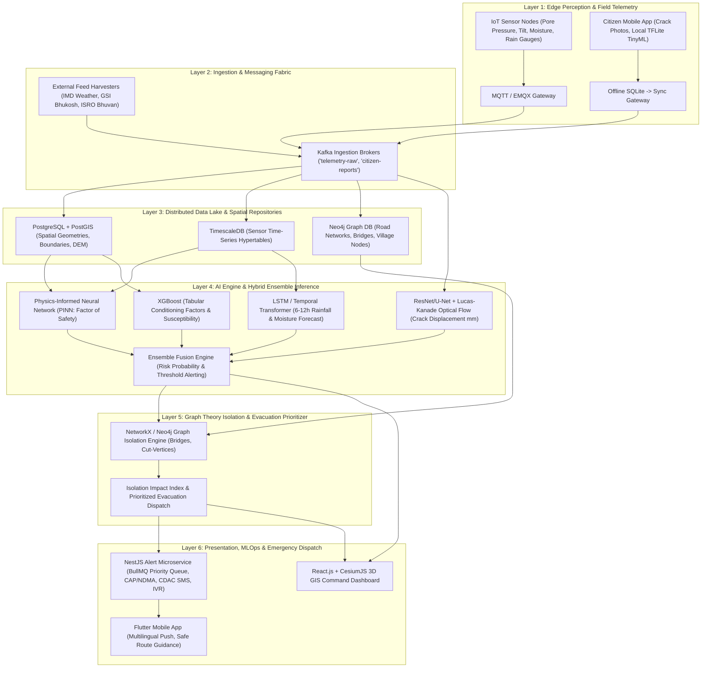

# Implementation Plan: AI-Based Landslide Early Warning & Risk Monitoring System (NER, India - MDoNER ID: 26001)

## Executive Summary & Problem Context
The North Eastern Region (NER) of India—encompassing Assam, Meghalaya, Arunachal Pradesh, Nagaland, Manipur, Mizoram, Tripura, and Sikkim—experiences some of the world's highest rainfall intensities, complex seismic activity (Seismic Zones V & IV), and steep geological formations. Landslides frequently disrupt critical national highways (NH-29, NH-10, NH-44), cut off remote tribal habitations, and cause catastrophic loss of life and infrastructure.

This plan details the design, architecture, and production-grade implementation of an end-to-end, offline-first, multilingual, AI-driven Early Warning System (EWS). The platform unites real-time sensor telemetry, satellite remote sensing (ISRO Bhuvan/MOSDAC), geological conditioning factors (GSI Bhukosh), citizen-sourced crack detection, and graph-theoretic transportation isolation modeling.

---

## User Review Required

> [!IMPORTANT]
> **Production Architecture & Technology Commitments:**
> 1. **Zero-Internet Edge AI**: The Flutter mobile app will embed an optimized 8-bit quantized TensorFlow Lite model (`tiny_landslide_pinn.tflite` < 3.2MB) with local SQLite storage to run on-device risk inference even in deep valley shadow zones without network connectivity.
> 2. **Government of India Interoperability**: Alert dispatcher strictly adopts the **Common Alerting Protocol (CAP-IN v1.2 / OASIS)** compatible with NDMA SACHET, alongside CDAC SMS push and automated multilingual IVR calls via regional telecom gateways.
> 3. **The "Secret Sauce" Differentiator**: Neo4j-powered Graph Theory Isolation Index module that computes articulation points (cut vertices) and bridge edges in the Himalayan arterial road network to calculate the vulnerability index \(V_{isolation}\) of settlements cut off from emergency healthcare.
> 4. **Multilingual Inclusivity**: Real-time localization in **Assamese (অসমীয়া), Bodo (बर'), Khasi, Bengali (বাংলা), Hindi (हिन्दी), and English**.

---

## Architecture: The 6-Layer Production Framework



---

## Proposed Changes & Monorepo Layout

We will scaffold and implement a clean monorepo structure in `d:\SIHproject` containing:

```
d:/SIHproject/
├── backend/
│   ├── ai-engine/                 # Python FastAPI microservice for AI/ML inference
│   │   ├── app/
│   │   │   ├── api/routes/        # /predict, /cv/displacement, /forecast, /health
│   │   │   ├── core/              # Config, logging, telemetry
│   │   │   ├── models/            # PINN, LSTM, XGBoost, U-Net, Ensemble Fusion
│   │   │   ├── physics/           # Slope stability equations (Factor of Safety)
│   │   │   ├── schemas/           # Pydantic models for inputs/outputs
│   │   │   └── services/          # Model serving, preprocessing pipelines
│   │   ├── Dockerfile
│   │   └── requirements.txt
│   ├── alert-dispatcher/          # NestJS Node.js/TypeScript microservice
│   │   ├── src/
│   │   │   ├── alert/             # Alert lifecycle, priority rules, CAP v1.2 formatter
│   │   │   ├── channels/          # CDAC SMS, Twilio/Karix IVR, FCM Push, MQTT siren
│   │   │   ├── queue/             # BullMQ workers, rate-limiters, dead-letter queues
│   │   │   ├── isolation/         # Neo4j graph connector & evacuation routing
│   │   │   ├── sync/              # Mobile offline sync conflict resolution
│   │   │   └── main.ts
│   │   ├── package.json
│   │   └── Dockerfile
│   └── graph-isolation/           # Python Graph Theory Isolation Index module (NetworkX/Neo4j)
│       ├── isolation_index.py
│       └── tests/
├── ml-training/                   # Offline training, feature engineering, evaluation
│   ├── data/
│   │   ├── historical_rainfall_ner.csv   # User-provided 117-year IMD rainfall dataset
│   │   ├── schemas/               # CSV/GeoJSON templates (Inventory, Conditioning, Sensors)
│   │   └── raw/
│   ├── pipelines/
│   │   ├── preprocess_spatial.py  # GeoPandas DEM extraction, slope, aspect, lithology
│   │   ├── train_pinn.py          # PyTorch Physics-Informed Neural Network with FS loss
│   │   ├── train_rainfall_lstm.py # PyTorch LSTM rainfall/soil moisture forecaster
│   │   ├── train_xgboost.py       # XGBoost training with SMOTE & Recall > 0.90 threshold
│   │   ├── train_crack_cv.py      # ResNet/U-Net + Optical Flow displacement benchmark
│   │   └── export_tflite.py       # Quantization to int8 TFLite for Flutter edge app
│   └── evaluation/
│       └── metrics_report.py      # Precision-Recall curves, Confusion Matrix, Brier score
├── frontend/                      # React 3D GIS Disaster Command Center
│   ├── public/
│   ├── src/
│   │   ├── components/
│   │   │   ├── 3d-map/            # CesiumJS 3D globe, terrain, heatmaps, road closures
│   │   │   ├── alerts/            # Real-time triage feed, CAP alert composer
│   │   │   ├── analytics/         # Sensor time-series graphs, PINN FS gauges
│   │   │   └── isolation/         # Village isolation graph visualizer
│   │   ├── locales/               # Multilingual i18n JSON files
│   │   └── App.jsx
│   ├── package.json
│   └── Dockerfile
├── mobile-app/                    # Flutter cross-platform offline-first mobile app
│   ├── lib/
│   │   ├── core/                  # Database (Drift/SQLite), Sync Manager, Background tasks
│   │   ├── ml/                    # TFLite TinyML local inference engine
│   │   ├── l10n/                  # 6 Languages (en, as, bn, hi, bodo, khasi)
│   │   ├── screens/               # Home, ReportLandslide (with camera), Alerts, OfflineSync
│   │   └── main.dart
│   └── pubspec.yaml
├── infrastructure/
│   ├── docker-compose.yml         # Local stack (Postgres/PostGIS, Timescale, Neo4j, Kafka, EMQX, Redis)
│   ├── k8s/                       # Kubernetes manifests (deployments, services, HPA, ingress)
│   └── database/
│       ├── postgres_postgis.sql   # Spatial DDL & indexing
│       ├── timescaledb_sensors.sql# Sensor hypertables & continuous aggregates
│       └── neo4j_road_graph.cypher# Cypher schemas, nodes, edges & isolation queries
└── docs/
    ├── PRD.md                     # Product Requirements Document
    ├── TRD.md                     # Technical Requirements Document
    └── API_BLUEPRINT.md           # OpenAPI / REST / gRPC specs
```

---

## Detailed Component Specifications

### 1. Database Schemas (DDL & Cypher)
- **PostgreSQL / PostGIS**: Spatial schema for landslide zones, administrative boundaries, geological formations (GSI Bhukosh), roads, and citizen reports.
- **TimescaleDB**: Hypertables for real-time IoT pore water pressure, soil moisture percentage, tilt-meter inclination angles, and continuous aggregates for hourly rolling precipitation.
- **Neo4j**: Graph structure connecting `(:Village)`, `(:RoadSegment)`, `(:Bridge)`, and `(:ReliefCamp)` with edge weights representing travel times and susceptibility weights.
  - Queries for finding *Bridges* (edges whose failure disconnects the graph) and *Articulation Points* (nodes whose removal isolates subgraphs).

### 2. AI Hybrid Ensemble Core
- **Physics-Informed Neural Net (PINN)**: Formulates loss as \(\mathcal{L} = \mathcal{L}_{data} + \lambda \mathcal{L}_{physics}\), where \(\mathcal{L}_{physics}\) enforces the Infinite Slope Factor of Safety:
  \[
  FS = \frac{c' + (\gamma z - u) \cos^2\beta \tan\phi'}{\gamma z \sin\beta \cos\beta}
  \]
  where \(c'\) is effective cohesion, \(\gamma\) is soil unit weight, \(z\) is shear failure depth, \(u\) is pore water pressure (from TimescaleDB IoT), \(\beta\) is slope angle (from DEM), and \(\phi'\) is internal friction angle. If \(FS < 1.0\), the slope is mechanically unstable.
- **LSTM Rain & Moisture Forecaster**: Sequences 6h/12h sliding windows of rainfall intensity to forecast soil saturation index.
- **XGBoost Susceptibility Classifier**: Tuned with scale_pos_weight and SMOTE to ensure **Recall > 0.90** for high-risk zones.
- **Computer Vision Crack Displacement**: Lucas-Kanade optical flow on citizen paired photographs taken across timestamps with scale calibration markers to quantify displacement rate (mm/day).

### 3. Graph Theory Isolation Index Module
- For each road segment \(e = (u, v)\):
  1. Simulate failure of \(e\).
  2. Perform Tarjan's bridge-finding algorithm or biconnected components analysis.
  3. Identify all villages \(V_i\) that have path existence \(\text{Path}(V_i, \text{DistrictHQ}) = \emptyset\).
  4. Compute **Village Isolation Index**:
     \[
     I_{village}(V_i) = \text{Pop}(V_i) \times \left(1 + \frac{\text{VulnerablePop}(V_i)}{\text{TotalPop}(V_i)}\right) \times \frac{1}{\text{AccessRoutes}(V_i)}
     \]
  5. Generate prioritized evacuation dispatch lists and helicopter airdrop coordinates.

### 4. Alert Dispatcher (NestJS + BullMQ + CAP v1.2)
- Multi-tier priority queues in Redis BullMQ (Urgent / High / Informational).
- OASIS Common Alerting Protocol (CAP) XML serialization for automated integration with the NDMA Sachet system.
- CDAC SMS gateway integration with localized templates.
- IVR voice automated calls with synthesized regional voice prompts for low-literacy communities.

### 5. Flutter Mobile App (Offline-First + TinyML)
- Drift / SQLite database storing pre-downloaded spatial tile polygons for the user's district.
- Background sync worker that pushes locally queued reports and fetches updated risk polygons when network (2G/3G/4G/WiFi) is restored.
- TFLite runtime running local risk scoring using the phone's accelerometer/gyroscope (tilt detection) and manual entry of rain conditions.
- Multilingual i18n supporting 6 languages (Assamese, Bodo, Khasi, Bengali, Hindi, English).

### 6. React.js + CesiumJS 3D Web Dashboard
- Ultra-premium dark-mode UI with high-contrast tactical alert colors (Green: Normal, Yellow: Advisory, Orange: Watch, Red: Warning, Purple: Evacuation Mandate).
- CesiumJS 3D terrain rendering of Himalayan topography with extruded hazard polygons and animated particle precipitation.
- Interactive road cut simulator: clicking any highway segment instantly previews isolated villages and alternate emergency corridors.

---

## Verification & Testing Plan

### Automated Tests
1. **Python AI Engine**:
   - `pytest` for PINN Factor of Safety equation validation (ensure \(FS < 1\) produces high risk).
   - XGBoost validation check confirming Recall > 0.90 on cross-validation sets.
   - Optical flow displacement test on test image pairs with simulated pixel shift.
2. **Graph Theory Isolation Index**:
   - NetworkX graph unit tests verifying that removing a cut-edge correctly flags isolated downstream clusters.
3. **NestJS Alert Engine**:
   - Jest unit tests for CAP XML generation compliance with OASIS CAP-IN v1.2 schema.
   - BullMQ retry logic test (failed SMS retry exponential backoff).
4. **Data Validation**:
   - Validation test for the CSV/GeoJSON schemas ensuring data types, lat/long bounds (\(21.5^\circ - 29.5^\circ \text{N}\), \(88.0^\circ - 97.5^\circ \text{E}\)), and sensor timestamp formats.

### Manual Verification
- Visual inspection of the CesiumJS 3D dashboard rendering and interactive graph theory isolation simulator.
- Verification of multilingual localization strings for all 6 languages.
- End-to-end dry-run of an offline mobile report creation, local SQLite persistence, and subsequent sync reconciliation.
